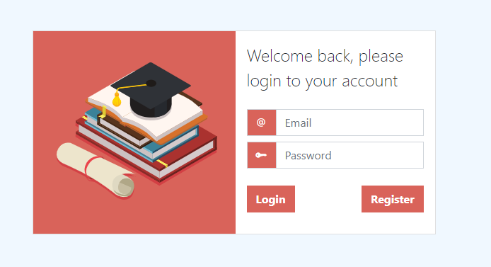

# Grades Management
GradesManagement is a SPA for managing courses, classes, students and their grades.

 

# Tech/framework used
* NodeJS
* MongoDB
* Angular
* TypeScript
* Bootstrap 5

# Setup

Install Node, MongoDB, Angular CLI.

Generate the public.key and private.key files inside the server folder using [Online RSA Key Generator](https://travistidwell.com/jsencrypt/demo/) or another RSA Key generator tool.

Install server and client dependencies using `npm i`.

Run `npm run start` on the server folder.

Run `ng serve -o` on the client folder.

For more instructions on how to setup the MongoDB please refer to this [repository](https://github.com/bobmacneal/node-api-jwt).

# Authors
* [Rafael Duarte](https://github.com/Duarte10)

# Credits

* [node-api-jwt](https://github.com/bobmacneal/node-api-jwt) - Boleirplate NodeJS & MongoDb with JWT authentication code.

# License
This project is licensed under the MIT License - see the [LICENSE](https://github.com/Duarte10/HealthPlace/blob/main/LICENSE) for more details
